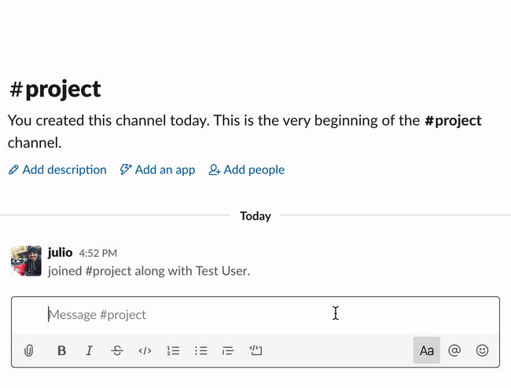
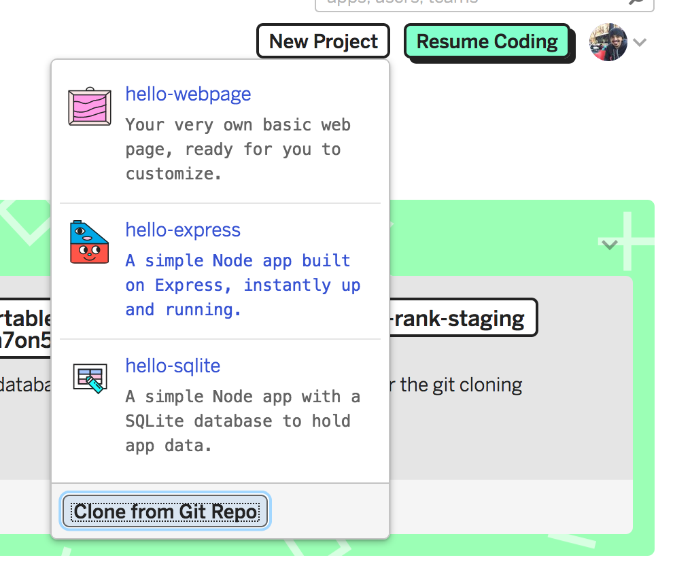
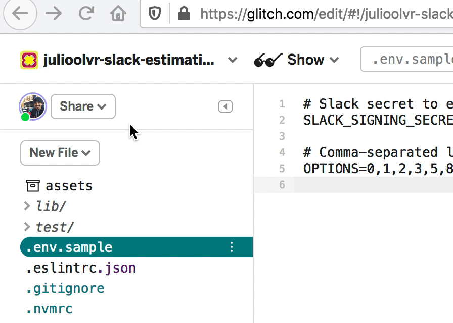
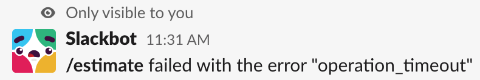

# Slack Estimation

Slack bot to estimate work with a team. Easily deployable on [Glitch](https://glitch.com)!



## Usage

```
/estimate {task name}
```

## Why?

There are a number of similar projects out there. Some of them were down from time to time so I wanted to create something that would be easy to deploy and that I'd have full control over.

## Deploy your own

I currently use this project deployed on [Glitch](https://glitch.com). See some of the caveats further down this README.

1. Clone this project into Glitch. There's a convenient "Clone from Git Repo" button that you can use:



2. Create a `.env` file (see `.env.sample`). You can define the options you want the bot to show for estimations, and set Slack's secret so you know the request coming to your bot are legitimate (more on that below).

3. Now to create the Slack app - go to https://api.slack.com/apps and click on "Create New App". Give it a name and assign it to the workspace you want the bot on.

4. You'll see your app's "Basic Information" page. Scroll down and find your "Signing Secret" - this is what you have to add to your `.env` file.

5. Now go to "Slash Commands" and create a new command.

6. Define your command (I use `/estimate`). For the URL you'll need your Glitch's app URL which you can find under the "Share" menu. Add `/start` to the end, so it'll look like `https://slack-estimation.glitch.me/start`.

.

7. Go to "Interactive Components" and enable interactivity. For request URL, use the same as above but ending in `/vote`, so something like `https://slack-estimation.glitch.me/vote`.

8. Go back to your app's "Basic Info" in Slack, find "Install your app to your workspace" and follow the instructions.

And that's it! Your app should be working now.

## Caveats

In Glitch, projects sleep after 5 minutes being unused. This app stores tasks being estimated in memory. This means that if 5 minutes pass without anyone interacting with the app, it'll go to sleep and all estimations in progress will get lost! In practice this hasn't been an issue, but since Glitch supports persisting data in the filesystem I want to do that in the future.

Also, it'll take some time for the app to wake up after those 5 minutes (the fact that it compiles from TS on each start doesn't help, something to improve). The first time you use the bot after some period of inactivity, you'll see a timeout error:

.

Not to worry - give it a couple of seconds and the app will come up and you can start estimating.
